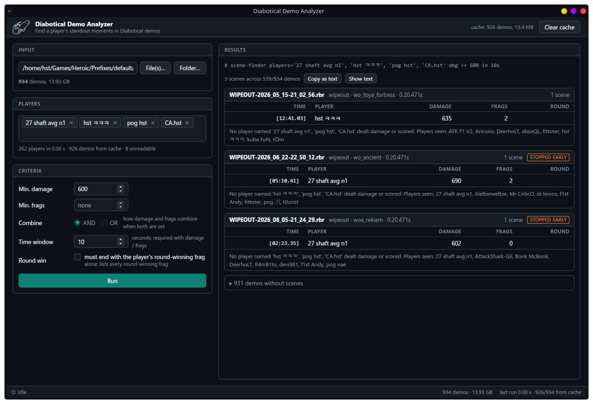

# Diabotical Demo Analyzer

A desktop app that finds a player's standout moments ("scenes") in Diabotical demo files: high-damage fights, frag streaks, fast movement, strong weapon-specific performance, and optionally only scenes that end with the player's round-winning frag.

Built for large collections: a folder of ~1000 demos (14 GB) scanned in ~9s on my NVME.\
Extracted data is cached so every later run with different parameters is instant.



## Where to find your replays

Diabotical writes replays to the following folders. Point the app at this folder (or drop it onto the window) to scan all of them:

| Platform | Folder |
|---|---|
| Windows | `C:\Users\<you>\AppData\Roaming\Diabotical\Replays\` (paste `%APPDATA%\Diabotical\Replays` into Explorer) |
| Linux (Heroic, Wine/Proton prefix) | `~/Games/Heroic/Prefixes/default/Diabotical/pfx/drive_c/users/steamuser/AppData/Roaming/Diabotical/Replays/` |

## Usage

1. Pick a demo file (`.rbr` client recording, `.srd` server recording) or a folder, or drop it anywhere onto the window. Folders are searched recursively.
2. Pick player names you want to look up (a player who joined mid-match may only show up after a full scan cached the demo).
3. Build criteria groups. Each group can match all or any of its criteria, and
   multiple groups can also match all or any. Criteria include damage, frags,
   movement speed, weapon accuracy, carrying the flag, siphonator active,
   round-winning frags, and required/excluded fallout deaths. Damage and frags
   can optionally be scoped to a weapon.
   Weapon-specific damage is available for the recording POV. Accuracy is the
   game's cumulative match-to-date value. Speed is the server-reported
   horizontal velocity, so teleporters do not create false spikes.
4. Run.
5. Use "Copy command" to copy a console command into the clipboard and paste it into the Diabotical console to watch the scene.

## Building

Prerequisites: Rust (stable), Node 22+, and the [Tauri 2 system dependencies](https://tauri.app/start/prerequisites/) for your platform.

```bash
npm install
npm run tauri dev      # development build with hot reload
npm run tauri build    # release bundle in src-tauri/target/release/bundle
```

The core lives in `crates/scenefinder-core` and has no Tauri dependency. It also builds a small command-line tool that mirrors the reference `scene-finder` CLI, useful for scripting and benchmarking:

```bash
cargo run --release -p scenefinder-core --features cli -- ~/demos -p PlayerName -dmg 200 -frags 2 -c or -t 5
cargo run --release -p scenefinder-core --features cli -- ~/demos -p PlayerName -speed 1200 -speed-for 1 -t 8
cargo run --release -p scenefinder-core --features cli -- ~/demos -p PlayerName -weapon 4 -dmg 300 -accuracy 35 -c and -t 10
cargo run --release -p scenefinder-core --features cli -- --discover ~/demos          # list player names
cargo run --release -p scenefinder-core --features cli -- --bench --no-cache ~/demos -p x -dmg 1 -t 5
```

Tests: `cargo test --workspace --features scenefinder-core/cli`.

## How it works

Each demo is read once through a streaming gzip inflate; the container framing is walked without decoding messages, and only the verified messages the search needs are decoded: movement velocity, POV assignment, damage, weapon accuracy, kill feed and killing weapon, flag state, siphonator events, team assignment, round score, and player names. Truncated recordings, which are common, are read up to the point where they stop. The compact per-demo extract is what gets cached, so later searches with different parameters are fast.

Demos are processed in parallel across all cores, largest first. Cancelling stops every worker within a chunk.
